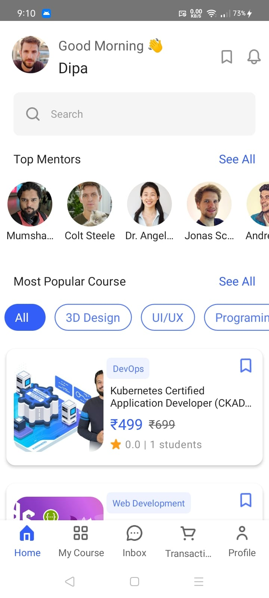
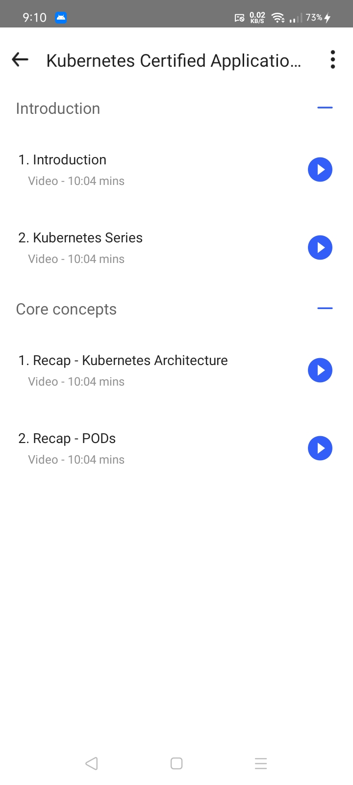
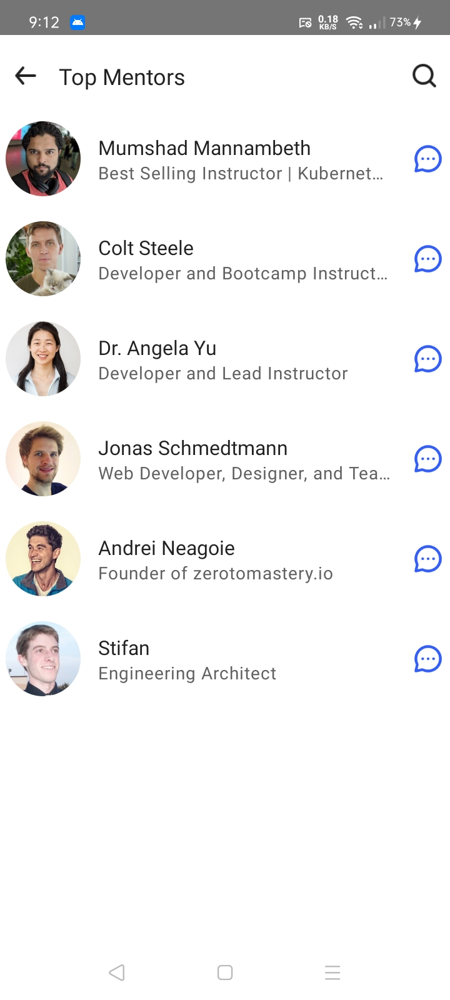
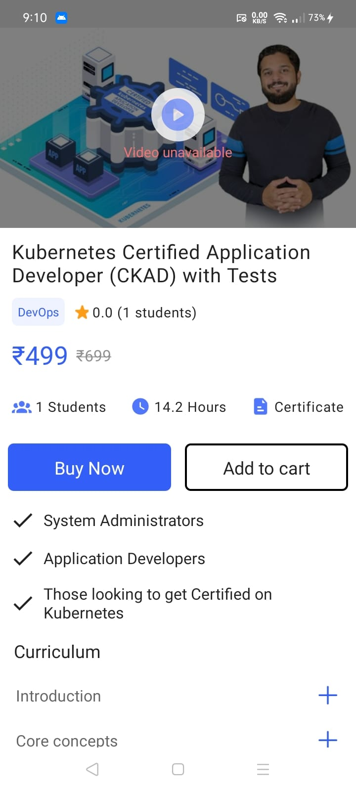
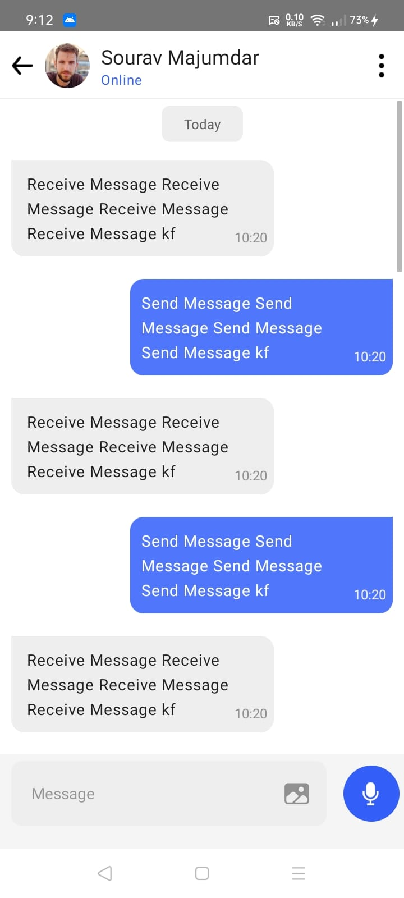
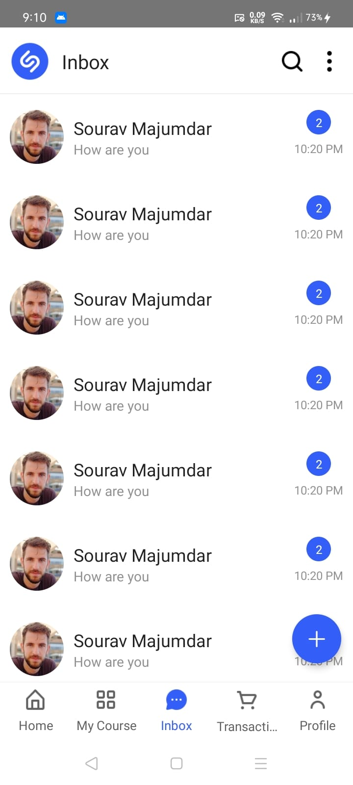
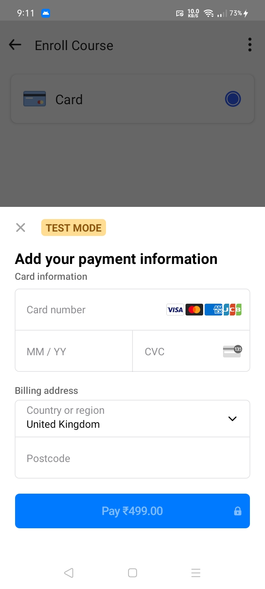
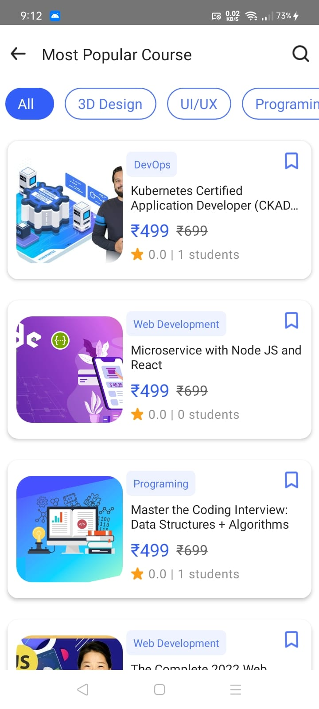
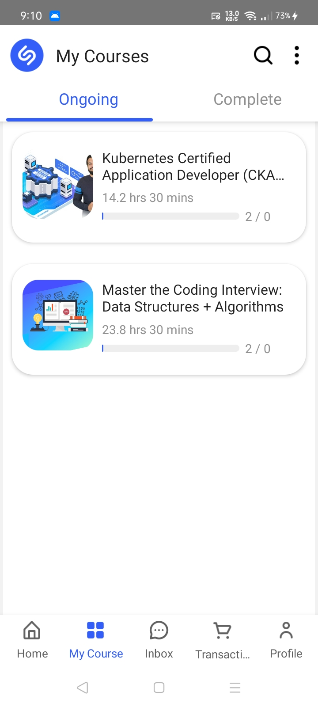
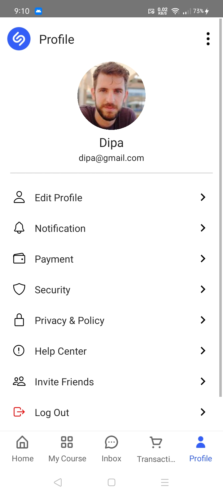

[![LinkedIn][linkedin-shield]][linkedin-url]

<!-- PROJECT LOGO -->
 

  
  <h3 align="center">Elear | Online learning app</h3>
  

    Elera is an online learning platform
  

   

 

   
   
   
    
    
   
   
   
   
   
   
   

<!-- ABOUT THE PROJECT -->

## About The Project
E-com is an online video-based learning platform. Where users can buy any type of course.

**Here's is some feature overview:**

- Signup and Login functionality
- User can view, filter, search & sort product
- Add to cart courses
- Payment functionality
- Video Player

### Built With

For this project, I am chosen my tech stack:

     

### Design credits goose to

**Sobakhul Munir Siroj** <a href="https://www.figma.com/@munirsr">@MunirSr</a>

## Contact

souravmajumdar.dev@gamil.com

Project Link: [https://github.com/souravdev-eng/elera-online-learning](https://github.com/souravdev-eng/elera-online-learning)

[linkedin-shield]: https://img.shields.io/badge/-LinkedIn-black.svg?style=for-the-badge&logo=linkedin&colorB=555
[linkedin-url]: https://www.linkedin.com/in/majumdarsourav/
